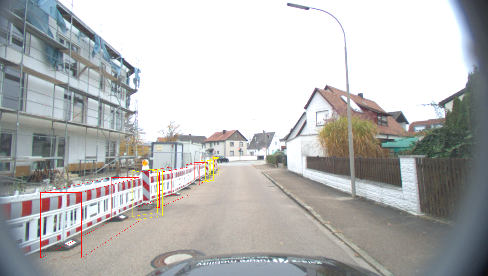
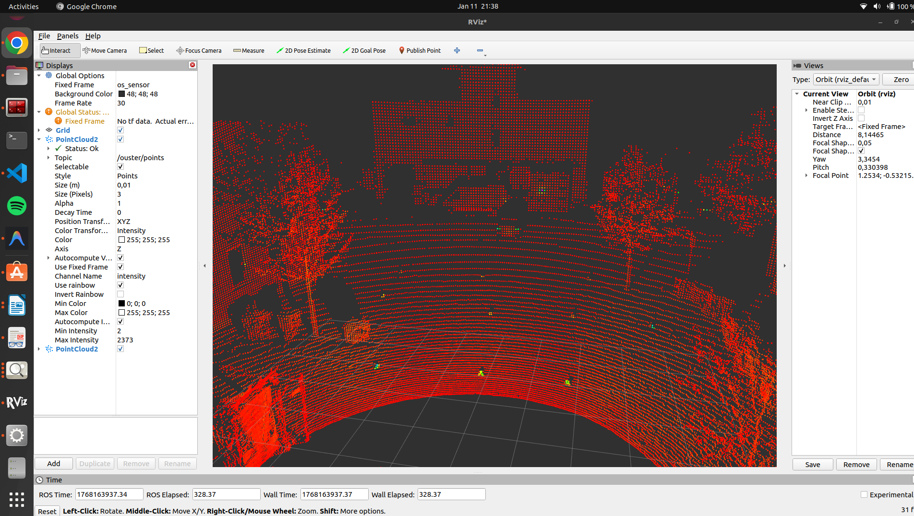
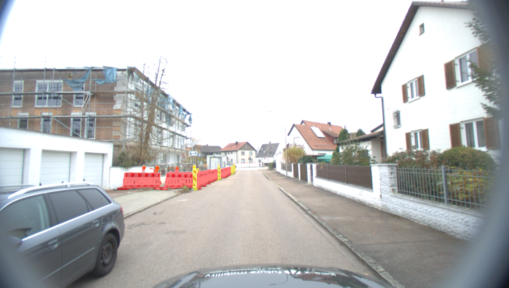
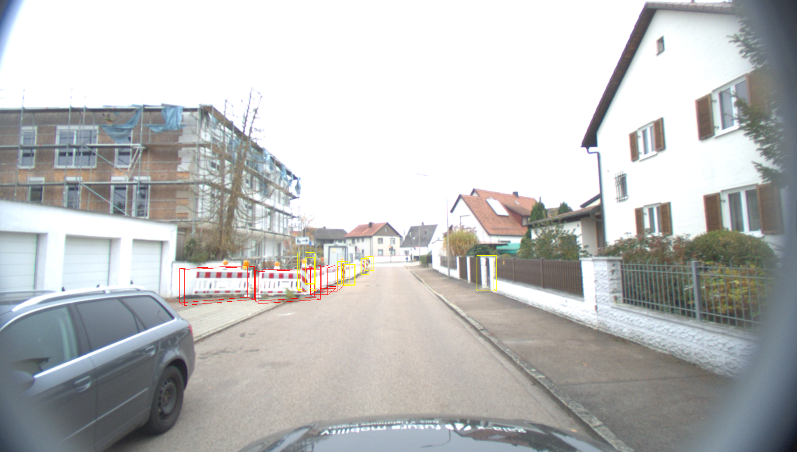
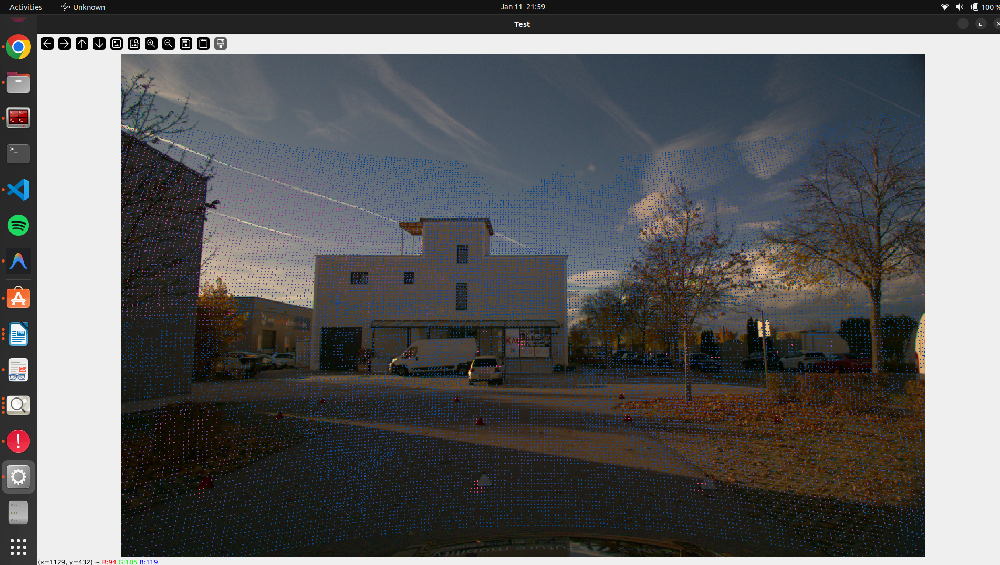
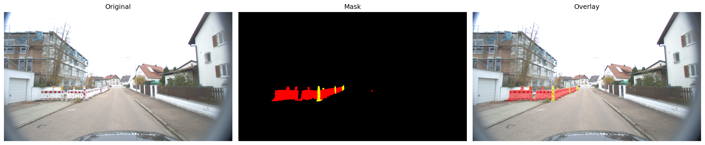
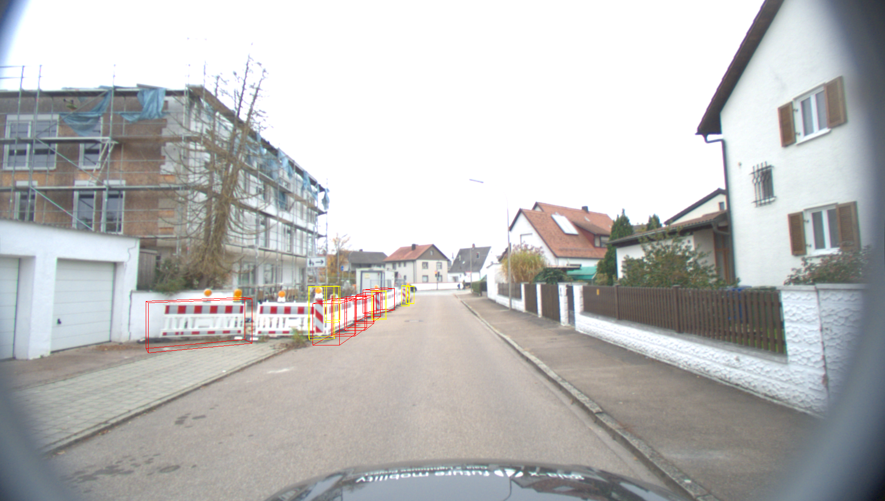
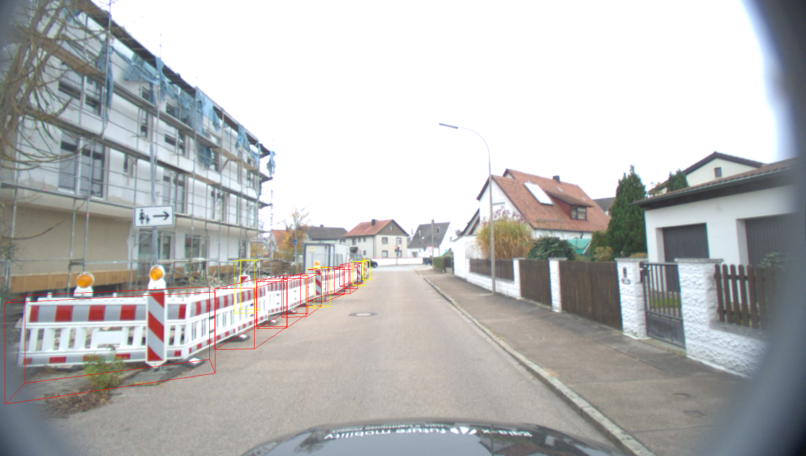

# Road Work Zone Detection & Perception

**Multi-camera/LiDAR calibration → semantic segmentation → 3D object detection**, built on a real research vehicle sensor rig at Technische Hochschule Ingolstadt (THI).

<p align="center">
  
  <br/>
  <em>3D bounding boxes (PointPillars) projected onto the camera image — detected construction barriers and cones</em>
</p>

This was a team project where each member completed individual technical tasks. The work documented here covers my individual contributions across three pipeline stages: **sensor calibration**, **semantic segmentation**, and **3D object detection**.

---

## Hardware Setup

- 7 cameras (1920×1200) mounted on a research vehicle
- Ouster LiDAR sensor
- Real-world data captured on streets in and around Ingolstadt, Germany
- ROS2 (tested on Ubuntu 24.04)

---

## Pipeline at a Glance

<table>
<tr>
<th>1. Calibration & Fusion</th>
<th>2. Semantic Segmentation</th>
<th>3. 3D Detection</th>
</tr>
<tr>
<td></td>
<td></td>
<td></td>
</tr>
<tr>
<td align="center">LiDAR point cloud, RViz</td>
<td align="center">Barrier/cone overlay, DeepLabV3+</td>
<td align="center">3D boxes, PointPillars</td>
</tr>
</table>

---

## Task 1 — Multi-Camera Calibration & LiDAR Fusion
`task1_calibration/`

- Intrinsic calibration of all 7 cameras using the checkerboard method
- Mean reprojection errors as low as **0.12 px** (cam1), most cameras under 0.35 px
- LiDAR-to-camera extrinsic transforms (4×4 SE3) via manual 3D↔2D point correspondences
- Verified fusion by projecting the LiDAR point cloud onto camera images

<p align="center">
  
  <br/>
  <em>LiDAR point cloud projected onto camera image — fusion verification</em>
</p>

| Camera | Mean Reprojection Error (px) |
|---|---|
| cam1 | 0.12 |
| cam7 | 0.20 |
| cam3 | 0.22 |
| cam4 | 0.25 |
| cam5 | 0.35 |
| cam2 | 0.43 |
| cam6 | 0.56 |

---

## Task 2 — Semantic Segmentation
`task2_segmentation/`

- Annotated 87 real-world road work zone images from the THI vehicle rig
- 2 classes: **construction barriers**, **traffic cones/pylons**
- Trained and evaluated DeepLabV3+ on the annotated dataset

<p align="center">
  
  <br/>
  <em>Original → predicted mask → overlay (red = barrier, yellow = cone)</em>
</p>

More examples (000000, 000005, 000017 — raw, mask, overlay) in [`task2_segmentation/sample_results/`](task2_segmentation/sample_results/).

---

## Task 3 — 3D Object Detection
`task3_detection/`

- 3D object detection using **PointPillars** (via OpenPCDet) on LiDAR point clouds
- KITTI-format labels generated for detected barriers and cones
- Inference + visualization pipeline projecting 3D boxes onto camera images
- All 87 scenes processed end to end

<table>
<tr>
<td></td>
<td></td>
</tr>
</table>

More results in [`task3_detection/sample_results/`](task3_detection/sample_results/) (includes KITTI label `.txt` files).

---

## Repository Structure

```text
road-work-zone-detection-perception/
├── task1_calibration/
│   ├── camera_intrinsic_all_cams.py      # intrinsic calibration script
│   ├── pnp_extrinsic_calibration.py      # extrinsic calibration script
│   ├── cam1.yaml ... cam7.yaml           # per-camera intrinsic results
│   └── extrinsic_cam1__TEST.json ...     # per-camera extrinsic (LiDAR→camera) results
├── task2_segmentation/
│   ├── main.py                           # DeepLabV3+ training entry point
│   ├── rzdg_dataset.py                   # custom dataset loader
│   └── sample_results/                   # raw images, masks, overlays
├── task3_detection/
│   ├── train_rzdg.py                     # PointPillars training script
│   ├── test.py                           # inference script
│   ├── rzdg.py                           # dataset handling for detection
│   ├── voxel_module.py                   # voxelization module
│   └── sample_results/                   # KITTI-format labels + 3D box visualizations
└── assets/                               # calibration & fusion verification screenshots
```

---

## Tech Stack

`Python` · `OpenCV` · `PyTorch` · `DeepLabV3+` · `PointPillars` · `OpenPCDet` · `ROS2` · `RViz` · `KITTI format`

---

## Notes

This repository contains the code and results for my individual contributions to a team project. Cloned third-party libraries (OpenPCDet, DeepLabV3Plus-Pytorch base implementation, PointPillars base implementation) are not included — only the scripts, configs, and results I produced.